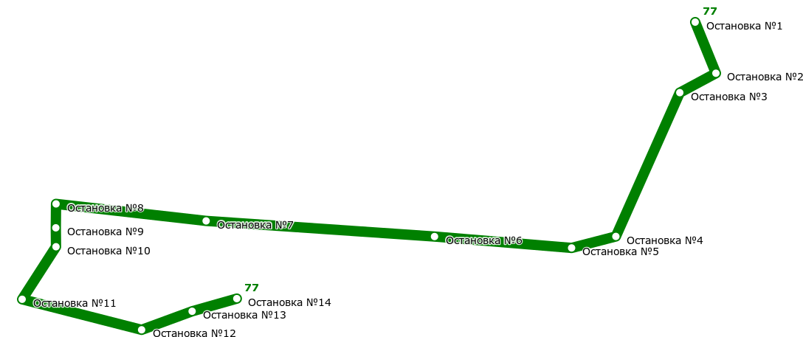

# Transport Catalogue Server

HTTP-сервер для работы с транспортным справочником.
Поддерживает хранение информации об остановках и маршрутах, обработку запросов, визуализацию карты и обновление данных.

Проект состоит из двух частей:

* **Transport Catalogue** — ядро, которое хранит информацию об остановках, автобусах, расстояниях, строит статистику маршрутов.
* **HTTP Server** — обертка над транспортным справочником, позволяющая работать с ним через REST API.

---

## Возможности

* **Transport Catalogue**

  * хранение остановок с координатами;
  * хранение автобусных маршрутов;
  * вычисление статистики маршрутов (количество остановок, длина, кривизна);
  * учет расстояний между остановками.

* **HTTP API**

  * `POST /load` — загрузка данных (`base_requests`, `render_settings`, `routing_settings`);
  * `POST /query` — выполнение `stat_requests` (Bus, Stop, Map, Route);
  * `GET /map` — рендер карты маршрутов в формате SVG;
  * `PUT /stop` — добавление остановки;
  * `PUT /bus` — добавление маршрута автобуса;
  * `PATCH /patch` — частичное обновление сущностей (например, добавление остановок в маршрут).

---

## Примеры запросов

### Добавление остановки

```http
PUT /stop
Content-Type: application/json

{
  "base_requests": [
    {
      "type": "Stop",
      "name": "СНТ Лесной Уголок",
      "latitude": 55.667273,
      "longitude": 38.103734,
      "road_distances": {
        "Поворот на Полушкино": 2500,
        "Поворот на Зюзино": 500
      }
    }
  ]
}
```

### Добавление маршрута

```http
PUT /bus
Content-Type: application/json

{
  "base_requests": [
    {
      "type": "Bus",
      "name": "38",
      "stops": [
        "Остановка №1",
        "Остановка №2",
        "Остановка №3"
      ],
      "is_roundtrip": false
    }
  ]
}
```

### Частичное обновление маршрута

```http
PATCH /patch
Content-Type: application/json

{
  "base_requests": [
    {
      "type": "Bus",
      "name": "37",
      "stops": [
        "СНТ Лесной Уголок"
      ],
      "position": 3,
      "is_roundtrip": false
    }
  ]
}
```

### Выполнение запроса (статистика по маршруту)

```http
POST /query
Content-Type: application/json

{
  "stat_requests": [
    {
      "id": 1,
      "name": "37",
      "type": "Bus"
    }
  ]
}
```

### Получение карты

```http
GET /map
```

Ответ: SVG-документ.
Пример визуализации карты маршрутов:



---

## Сборка и запуск

```bash
make run
```

Сервер запустится на [http://localhost:8080](http://localhost:8080).

---

## Зависимости

* C++17
* [cpp-httplib](https://github.com/yhirose/cpp-httplib) — HTTP сервер
* Встроенный JSON-парсер
* SVG-рендер для визуализации карты

---

🚀 `transport-catalogue` можно использовать как самостоятельную библиотеку для работы с транспортными данными или как сервер через REST API.